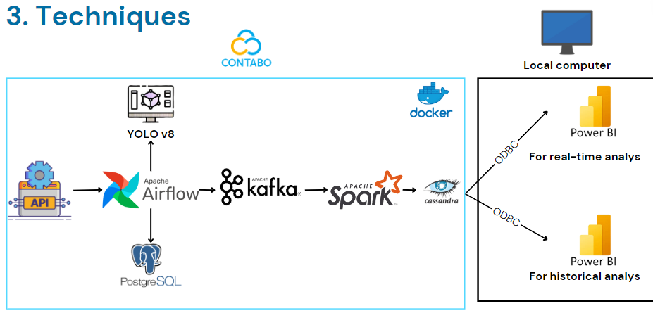
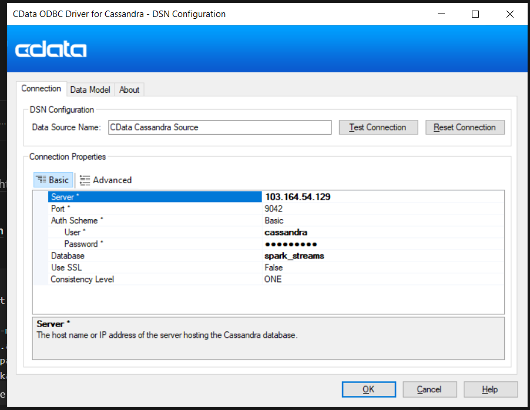

# Realtime Data Streaming 

## Table of Contents
- [Introduction](#introduction)
- [System Architecture](#system-architecture)
- [Technologies](#technologies)
- [Getting Started](#getting-started)

## Introduction

This project is about building an near real-time data pipeline. This project is focused on developing an application that can perform real-time analysis of the weather conditions, service quality, and traffic status in Ho Chi Minh City

## System Architecture



The project is designed with the following components:

- **Data Source**: We use three sources: Weather API from [tomorrow](https://www.tomorrow.io/), [Google Map API](https://github.com/GrocerCheck/LivePopularTimes), traffic camera in Ho Chi Minh government [website](http://giaothong.hochiminhcity.gov.vn/)
- **Apache Airflow**: Responsible for orchestrating the pipeline and storing fetched data in a PostgreSQL database.
- **PostgreSQL**: Store metadata of Airflow
- **YOLOv8**: A state-of-the-art deep learning model designed for real-time vehicle detection
- **Apache Kafka**: Used for streaming data from PostgreSQL to the processing engine.
- **Apache Spark**: For data processing with its master and worker nodes.
- **Cassandra**: Where the processed data will be stored.
- **PowerBI**: Visualizing data in real-time and historical

## Technologies

- Apache Airflow
- Python
- Flask
- Apache Kafka
- Apache Zookeeper
- Apache Spark
- Cassandra
- PostgreSQL
- Docker
- PowerBI

## Getting Started

### About Dashboard 
Dashboard in folder `/dashboard` contain two file *analys_report* and *realtime_report*. 
   - *realtime_report* visualize all information in real-time. When ever we refresh, it will update the current status 
   - *analys_report* is a report we use to propose storytelling 

### YOLOv8 Object Detection API Setup

1. *Download Pre-trained Model:*
   Download the YOLOv8 pre-trained model [here](https://github.com/ultralytics/assets/releases/download/v8.2.0/yolov8x.pt) and put it into `/yolov8`

2. *Install Ultralytics Library:*
   Use pip to install the Ultralytics library:
   ```bash
   pip install ultralytics
   ```
   

3. *Write API Code:*
   Create an API code to process images using YOLOv8 and return JSON object with vehicle count and traffic status.

4. *Create Systemd Service:*
   Define a systemd service file (api_object_count.service) to run your API code as a service. Example:
   ```bash
   [Unit]
   Description=API Object Count Service
   After=network.target

   [Service]
   WorkingDirectory=/path/to/api_detect_object.py
   ExecStart=/usr/bin/python3 api_detect_object.py
   Restart=always

   [Install]
   WantedBy=multi-user.target
   ```

5. *Start Service:*
   Initiate the service:
   ```bash
   sudo systemctl start api_object_count
   ```

6. *Expose Port:*
   Ensure API listens on 0.0.0.0 to accept requests from other VPSs.

### Start pipeline and dashboard

1. Run Docker Compose to spin up the services:
    ```bash
    docker-compose up
    ```

2. Access airflow webserver ui (http://localhost:8080/) to start the job 

3. Run spark-job 

    ```bash
    spark-submit --master spark://localhost:7077 \
    --packages org.apache.spark:spark-sql-kafka-0-10_2.12:3.1 \
    com.datastax.spark:spark-cassandra-connector_2.12:3.5.0,\
    org.apache.kafka:kafka-clients:3.5.1,\
    org.apache.spark:spark-token-provider-kafka-0-10_2.12:3.5.1 spark_stream.py
    ```

    or if use already have spark in machine

    ```bash
    python spark_stream.py
    ```

4. Connect cassandra database to Excel and powerBI

    - Install [Cdata driver](https://www.cdata.com/drivers/cassandra/odbc/) (optional)
    - After install, config as below. In this case we run on VPS (replace server ip with localhost if you run in local)

    - Go to Excel/PowerBI select source data using ODBC and connect to CDATA which already set up

5. Open PowerBI and start visualize

    `Important`: Don't click refresh in *realtime_report.pbix* because we already shut down the VPS where the datasource of this report retrieve to
